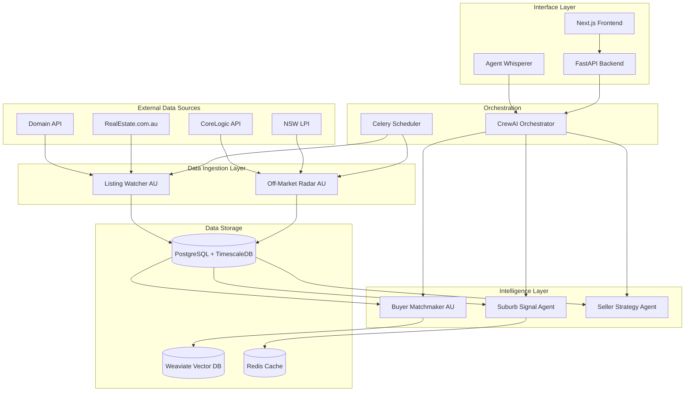
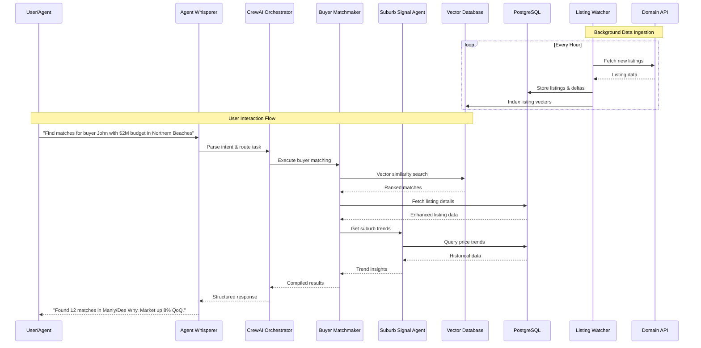
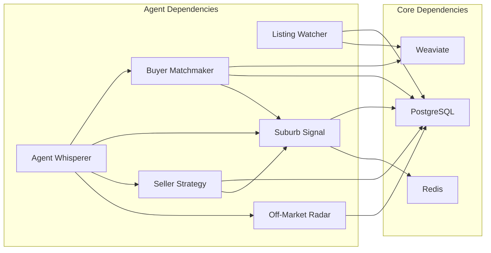

# ReAgent Sydney - System Design Document

## Problem Statement

Real estate agents in Sydney face information fragmentation across multiple platforms (Domain, REA, CoreLogic) with no unified intelligence layer. Manual monitoring of price changes, buyer matching, and market trends leads to missed opportunities and suboptimal pricing strategies.

## Goals

### Primary Goals
- **Real-time Intelligence**: Monitor 100+ daily listings across Sydney LGAs with <1hr latency
- **Intelligent Matching**: Vector-based buyer-listing matching with 80%+ relevance score
- **Market Insights**: Automated suburb trend detection and pricing recommendations
- **Natural Interface**: Chat-based agent interaction with on-demand reporting

### Success Metrics
- Process 500+ listings/day with 99.5% uptime
- Generate buyer matches within 15 minutes of new listings
- Achieve <2 second response time for agent queries
- Detect price changes within 1 hour of occurrence

## System Constraints

### MVP Constraints
- **Budget**: Single-user prototype, minimal API costs
- **Compliance**: Basic privacy handling, no full GDPR initially
- **Scale**: Sydney metro area only, 10-50 active buyers max
- **Data Sources**: Public APIs only, no premium data feeds initially

### Technical Constraints
- **Rate Limits**: Domain API (1000 calls/day), REA (500 calls/day)
- **Storage**: PostgreSQL + TimescaleDB for time-series data
- **Compute**: Local/VPS deployment with Docker Compose
- **Latency**: Sub-second response for cached queries, <30s for complex analysis

## Architecture Overview

## System Sequence Diagram

## Component Dependencies

## Failure Modes & Resilience

### Data Source Failures
- **API Rate Limits**: Exponential backoff, request queuing
- **API Downtime**: Graceful degradation, cached data serving
- **Data Quality**: Validation pipelines, anomaly detection

### System Failures
- **Database Outage**: Connection pooling, retry logic
- **Vector DB Failure**: Fallback to PostgreSQL similarity
- **Agent Crashes**: Automatic restart, health monitoring

### Recovery Strategies
- **Data Consistency**: Write-ahead logging, transaction boundaries
- **State Recovery**: Agent checkpoint persistence
- **Monitoring**: Docker health checks, log aggregation